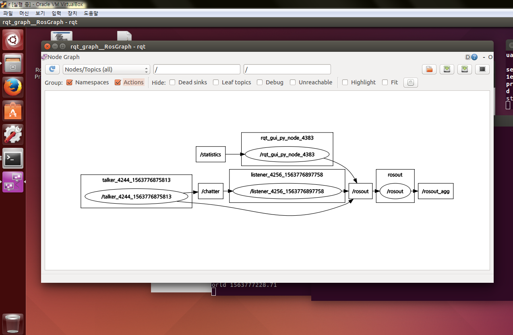

# ROS 및 QT 프로그래밍


Work Space >> Package >> Node

- roscore : 노드가 시작될 때 노드를 연결 해주는 명령어
>roscore는 프로그램 시작부터 끝까지 항상 켜 있어야 좋다.
- rosrun : node 하나를 실행시키는 명령어
```sh
$ roscore
$ rosrun rospy_tutorials talker
$ rosrun rospy_tutiruial listener
```
>roscore, node(talker, listener)의 실행 순서는 무엇을 먼저하든 상관없다.

```
$ rqt_graph
```


>ros는 namespace와 remapping으로 로봇을 구분한다.
```bash
#remapping
$ ./image_view image:=right/image
#assign namespace
$ ./camera __ns:=right
```

#### ros는 메타 os이기 때문에 각 프로그램마다 다른 단위를 맞춰주기 위해 tf(좌표 변환)을 사용한다.

