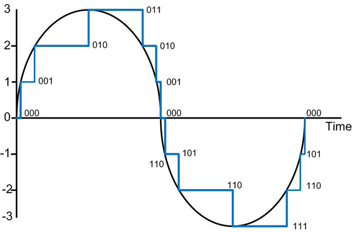

<h1><b> 5주차 </b> </h1>

- 프로젝트 주제
  - RTC로 LCD화면 출력
  - BUZZER TEST를 PWM으로 구현
  - 가변저항으로 LCD 터치패널 제어
  - DMA사용하여 신호 처리

>시리얼 통신 개요도

* Uart는 통신 속도가 느리다

<h3><b> 타이머 작동 순서 </b></h3>

<blockquote>
TCNTx = HZ * Time(sec)
</blockquote>

1. TCNTB값을 설정한다.
2. 메뉴얼 업데이트를 하게되면(0->1) 설정값이 타이머로 들어간다.
3. rTCON이 타이머를 실행시킨다.  
4. TCNTx가 설정된 값을 읽어들인다.
5. 0이될때까지 TCNTx값(설정된 값)이 줄어든다.

<h3> <b> RTC 사용 용도 </b> </h3>

- 시계
- 달력(with Y2K)  
- 알람(with Low power mode)  
  - 잠자고 있는 CPU를 RTC가 동작하도록 함

<h3>플래시 메모리 </h4>
- NOR Flash : 프로그램  
- NAND Flash : 프로그램 저장, 데이터 저장

- Polling 방식 : 사용자가 입력할 때 까지 계속 확인
- Interrupt 방식 : 사용자가 입력하면 전기신호가 발생하여 작동

<h3> interrupt controller</h3>
- 인터럽트 멀티플렉서

<h3>ARM에서 인터럽트 확인하는 법</h3>
1. 인터럽트 상태 레지스터(1,2...)를 통해 확인함 
2. 확인 하면 해당 인터럽트 함수를 Call 한다(실행)  
3. 인터럽트 정보를 지운다.   
4. 레지스터를 복구한다.    

## 인터럽트 용어
- 인터럽트 마스크  
  A central processing unit (CPU) feature that allows the computer to ignore (mask) an interrupt request until the mask bit is disabled.
- 인터럽트 우선순위  
  - 정적 우선수위: 인터럽트 번호가 우선순위를 의미함
  - 동적 우선순위: 임의로 우선순위를 설정하는 우선순위
  - 보통 ARM이 스스로 판단하도록 함  
  - FIQ>IRQ
- 인터럽트 백터 : ISR(Interrupt Service Routine)의 시작주소

>인터럽트는 상태 클리어가 반드시 필요함  

### 인터럽트 상태 클리어 방법  
~~~c
//Pending Register Clear
rSRCPND1 = (1<<7)|(1<<10);  
rINTPND1 = (1<<10)|(1<<10);
~~~

인터럽트 신호 전달 체계
ARM|<--|rINTPND1|<--|rINTMSK1|<--|rSRCPND1|<--|주변장치  
---|---|------|----|---|---|---|---|---
|||(마스킹 후)||(마스킹)||(마스킹 전)

~~~c
rINTMSK1 = rINTMSK1 &~ (1<<1); //ETHER (IRQ Active)
rSRCPND1 ? 0b10000010
rINTPND1 ? 0b00000010

rSRCPND1 = (1<<3); // 0b10000010 -> 0b10000010
rSRCPND1 = (1<<1); // 1st(0b1000010 -> 0b1000000)
rINTPND1 = (1<<1); // 2nd(0b0000010 -> 0b0000000)
~~~

### Interrupt register Bit clear
1. If the FIQ mode interrupt occurs, the corresponding bit of INTPND will not be turned on as the INTPND register is
 available only for IRQ mode interrupt.
2. Cautions in clearing the INTPND register. The INTPND register is cleared to "0" by writing "1". If the INTPND bit, which
 has "1", is cleared by "0", the INTPND register & INTOFFSET register may have unexpected value in some case.
 So, you never write "0" on the INTPND bit having "1". The convenient method to clear the INTPND register is writing the
 INTPND register value on the INTPND register. (In even our example code, this guide hasn't been applied yet.)  
 

<h1> DMA(Direce Memory Access) </h1>

 ### DMA의 데이터 복사
 DMA-> DMA.C(Controller)
 

 ### DMA작동 방법
 1. DAMC초기화
    - 소스: 사운드장치
    - 목적지: 메모리
    - 전송크기(byte), 소스 주소, 목적지 주소,
      전송단위(1/2/4), 블럭전송(유/무), 반복유무,
      ,전송완료 확인(interrupt), S.2450부가세팅
2. 기다림(Waiting)  
   - DMA전송 완료까지...주변장치
   - DMA Start(Trigger)..MEM2MEM Copy
3. DMA 전송완료
   
DMA특성
- 읽기(I/O)와 쓰기(RAM)가 동시에 이루어지기 때문에 속도가 빠르다.
- 전송단위는 I/O Device의 성능(버퍼 크기 등)을 고려해 설정한다.
- RAM에서의 쓰기는 전송단위가 빠른것이 유리함
- DMA는 속도가 중요한 곳(멀티미디어, 통신, 스토리지)에서 필요하다.

> [Compare with Demmand and Handshake Mode]
> 

- Demand mode
  - If XnXDREQ remains asserted, the next transfer starts immediately. Otherwise it waits for XnXDREQ to be asserted.
- Handshake mode
  -  If XnXDREQ is deasserted, DMA deasserts XnXDACK in 2cycles. Otherwise it waits until XnXDREQ is

* Caution: XnXDREQ has to be asserted (low) only after the deassertion (high) of XnXDACK. 

### DMA 전송크기 계산법
전송크기 = 단위의 크기 * Burst4 * 전송카운터(TC)  
(byte)     (1/2/4)            (1/4)       (?)  
전체크기 = DSZ * TSZ * TC

# ADC(AD Converter)

>ADC컨버터 개요(Sampling)
>

- Smapling: 아날로그 데이터를 주파수에 따라 모두 수치화(Digital화)하는 방법  
- Sampling 후에는 양자화(Quantization)를 수행한다.
- 양자화 오차(오류): 양자화 한 값과 실제 값의 차이가 발생하는 것
- ADC 사용 예: 센서, 마이크 등등...

# LCD

-LCD는 전용 DMA가 있어서 Buffer의 시작주소만 알려주면 알아서 해준다.

color|8bit(bpp)|16bit(bpp)|24bit(bpp)|32bit
---|---|---|---|---
monochrome|1bit(bpp)|2bit(bpp)|4bit(bpp)
||BW|Gray|Gray
* 8bit 는 특이하게 palette라 부름
- Palette는 기본 색상을 조합하는 형식이 아닌. 색상이 정해져있음
- 같은 색상을 표시할 때 16bit에 비해 드는 용량이 적다.

#### 16bit(64K colors)
- RGB555+1
- RGB565  
#### 24bit(16M colors)
- RGB888  
#### 32bit(16M colors)
- ARGB888
- RGBA888

