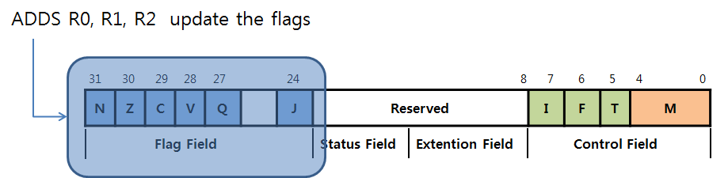

# 6주차 차량용 프로세스 이해

구분|CISC|LISC
---|---|---
역사|1960년대|1950년대
특징|메모리 참조연산|Load/Store구조
명령어|복잡|단순
성능|낮다|높다
대표|386|arm

### 폰노이만 아키텍쳐
- 명령어와 데이타를 구분하지 않는다.
- 같은 버스를 사용하기 때문에 명령어를 읽을 때
- 하버드 방식보다 속도가 느리다
- 산술 논리 장치와 프로세서 레지스터를 포함하는 처리 장치
- 명령 레지스터와 프로그램 카운터를 포함하는 컨트롤 유닛
- 데이터와 명령어를 저장하는 메모리
- 외부 대용량 스토리지
- 입출력 매커니즘
  
>폰 노이만 아케텍처


## 하버드 아키텍처
- ARM9, ARM11, Xscale  
- 하버드 아키텍처(Harvard architecture)는 본래 명령용 버스와 데이터용 버스로 물리적으로 분할한 컴퓨터 아키텍처를 나타내는 용어이다. (폰 노이만 구조와 대비시킨 용어이기도 하다).

>Harvard 아키텍처


## 리틀엔디안 & 빅엔디안

1. 리틀엔디언 하드웨어와 빅엔디언 하드웨어가 따로있나? - YES
2. 컴파일러도 리틀엔디언 컴파일러와 빅엔디언 컴파일러가 따로있나? - YES

### Stack memory를 사용하는 이유
Stack momory를 효율적으로 사용하기 위해

(Stack memory, Heap memory도 동일함)


어셈블리 파일 검색 방법
원하는 단어 입력 후
<CTRL+Shift+F>

레이블(label) 작성법

1. 알파뉴메릭(_ 포함)으로 작성
2. 1번 Column 에 작성(1번 열스페이스 금지)
3. 콜론(:)은 있을수도, 없을 수도 있음

bl의 역할(함수 호출 op코드)
lr = 복귀주소
pc = 이동할 함수주소

### mov: 복사 명령어
~~~
mov pc, lr @command return(pc=lr)  
mov L, R : R이 L로 복사 됨
~~~
<b>어셈블리어에 .globl(global)을 사용하지 않으면 함수가 파일 안에서만 효력이 발생된다.</b><br>

니모닉 코드(Directives:지시어)  
~~~
b . @bhile(1); 무한루프 infinite loop
~~~
ATPCS(ARM/Thumb Procedure Call Standard)

>mov r0, 0x1230이 안될 때 ldr r0, =0x1230으로 하면 된다.


### PSR 전송 명령
><b>cpsr은 중요한 명령어이기 때문이 mov명령어로 접근이 되지 않는다.</b><br>
- MSR cpsr, r0 @cpsr 쓰기 명령 r0->cpsr에 저장
- MRS r0, cpsr @cpsr 읽기 명령 cpsr
- MSR cpsr_f, r0 @_f(f, fc, fsxc...)를 붙이면 f(f, fc, fsxc)쪽의 8비트만 업로드되고, 나머지는 돈케어




```
    .globl disableIRQ
disableIRQ:
    MRS r0, cpsr
    orr r0, r0, #0x80
    MSR cpsr_c, r0
    mov pc, lr

```
```
    .globl enableIRQ
enableIRQ:
    MRS r0, cpsr
    orr r0, r0, #0x80
    MSR cpsr_c, r0
    mov pc, lr
```

LOAD/STORE
---
mov r4, #16  
ldr r0, [r1, r4, lsl #4] @r1=0x30100000   
str r0, [r2, r4, lsl #4] @r2=030200000   

ldrb r0, [r1, r4, lsl #4] @r1=0x30100000, 8비트만 처리  
strb r0, [r2, r4, lsl #4] @r2=030200000, 8비트만 처리   

mov r4, #16  
ldr r0, [r1, #4] @r1=0x30100000 -> 0x30100004

31-----2423-----1615------87--------0  
/-----------------------------------------------  
XXXXXXXXXXXXXXXXXXXXXXXXXXXXXXXX  
/-----------------------------------------------  
------A-------B---------C--------D-----           
strb r0, [r2, #4] @r2=0x30200000

lsrsb - signed, 8비트만 처리
(s)igned (b)가 같이 붙으면 8비트 외에 부분은 다 부호비트와 같은 값으로 처리함
### 양수일 때
31-------2423-------1615--------87----------0  
/------------------------------------------------  
0000 0000 0000 0000 0000 0000 XXXX XXXX  
/------------------------------------------------  
-----A-----------B----------C------------D-----           

### 음수일 때
31-----2423-----1615------87-----------0  
/--------------------------------------------  
111111111111111111111111XXXXXXXX  
/--------------------------------------------  
------A-------B---------C--------D-----------           

ldr r0, [r1, #4]! <-!가 붙으면 auto update(r1이 update가 된다)
r1+=4랑 동일

안붙으면 r1+4로 임시로 사용함

- Pre-Indexed addressing Mode  
str r0, [r2, #4] @ *(r2+4)

- Post-Indexed addressing Mode  
str r0, [r2],#4 @ r2 주소에 해당하는 값을 저정한후 r2+4만큼 이동

메모리를 불러오는 번지는 [] 안에서만 결정된다.
그 후에 +4를 하게됨

- pre-indexing은 update하여 주소에 있는 값을 register에 저장  
- post-indexing은 주소에 있는 값은 register에 저장 한 후 base값을 update 합니다.  
- auto-indexing은 update하여 주소에 있는 값을 register에 저장하고 또 base 값을 update하게 됩니다.  
출처: https://itpeace.tistory.com/9 [평화의 IT 이야기.]


블럭 전송 명령
---
ldm r0,{r4,r5,r6} @읽기(r0=0x30100000) =>  
ldr r4, [r0]!  
ldr r5, [r0]!  
ldr r6, [r0]!  
stm r1,{r4,r5,r6} @쓰기(r1=0x30110000)


ldm?? r0!,{r4-r6, r9}
??: da, db, ia, ib

push동작에 있어 stack pointer가 가리키는 곳에는
데이터가 써지지 않는다.

r4부터는 push/pop을 사용해야 한다.  
r0-r3까지는 temp의 용도이기에 push/pop을 사용하지 않는다.  
interrupt handler일 때에는 r0-r3도 push/pop을 사용한다.  
lr의 한계: lr은 한단계 호출밖에 하지 못한다. push/pop으로 lr을 저장해야 함.

Cache 쓰는 이유 속도를 빠르게 하기 위해

- Write(copy) back
  memory는 신경쓰지 않고 cache data만 신경쓸 때
  속도가 저하되지 않는다.
- Wirte(copy) through
  cache data 와 memory둘다 업데이트 하고 싶을 때  
  속도가 저하된다.
- data cache가 victim(새로운값에 의해 덮어씌어질 때)됐을 때
  memory의 값이 update된다.

cache flush - cache clean
cache를 운용하는 이유: 속도가 향상된다.


```
	.globl MMU_EnableICache
MMU_EnableICache:
	/* IMPLEMENT HERE */      
	mrc  p15,0,r0,c1,c0,0 @READ
    @c1값이 r0로 복사
	orr  r0,r0,#R1_I
	mcr  p15,0,r0,c1,c0,0 @WRITE
	mov	 pc,lr
```

```
          ---
mrc p15,0,r0,c1,c0,0 @READ
    ------   -------

mcr p15,0,r0,c1,c0,0 @READ

@r0, c1이 핵심
mrc c1->r0 복사
mcr r0->c1 복사

```

<h2> MMU(Memory Management Units) </h3>
<h3><b>주요기능</b></h3>
### 어드레스 변환(tranlation address)
CPU는 30000000번지가 가상주소인지 물리주소인지 모른다
CPU가 던진 30000000번지는 MMU로 전달된다. 그리고 가상주소를 물리주소로 변환된다.

### 메모리 보호(protect memory)
메모리에 접근하는 것들을 막는 역할을 한다

### OS가 탑재된 곳에 가치가 있음

```
MMU_SetMTT(0x00000000,0x07f00000,0x00000000,RW_NCNB); //bank0, 128mb mapping

몇 번지가 왔을때, 몇 번지로 바꾸어라 라는 테이블을 MMU가 참조한다.

```

### ARM주소 개념(address concept)

## 레지스터들은 무조건 RW_NCNB로 한다.


## Cache Memory

1. I-Cache / D-Cache 활성화 방법
2. Memory Mapped I/O D-Cache 비활성화
3. Cache Clean 과 Cache Flush(Invalidate)

DMA사용 시에는 D-Cache를 반드시 off한다.

## MMU
1. 링커(Linker) 스크립트 파일에서의 주소 표현
2. 예외처리(Exception) 벡터 테이블
3. 보호된 메모리 접근 -> Data Abort
4. 존재하지 않는 가상 메모리 접근 -> Data Abort

가상주소를 필요로 하는 S/W에서는 가상 주소로 접근한다.

왜 30000000번지 인가? CS(Chip Select or CE/Chip Enable)가 시작되는 주소이기 때문.

tool chain의 버전이 높다고 좋은게 아니라 사용하는 프로그램과 비슷한 버전의 크로스 컴파일러를 받아야 한다.


## Reset Exception

1. POR(Power Only Set, after power on)
2. H/W reset(input Reset switch)
3. WDT reset
4. (S/W reset, 소프트웨어마다 다름)
5. (PC=30000000, 암묵적 리셋)

- Undefined Instruction : 부정적인 Exception
- S/W Interrupt : 소프트웨어 명령어를 이용해 인터럽트를 실행(H/W 인터럽트와는 다름)
  swi 0x??? <-service code (각 숫자에 따른 명령어가 존재)<br>
  접근 할 수 없는 메모리에 swi를 이용해 특권모드로 변경하여 접근한다.
  

## Prefetch & Data Abort

1. (비정렬 엑세스, Data Abort only!)
2. 보호된 메모리 엑세스
3. 존재하지 않는 가상 메모리 엑세스
   
7|7|7
:-:|:-:|:-:
↓|↓|↓
37Reg|7Mem|7Excep


```c
HANDLER HandlerDabort, HandleDabort
	/* macro 정의 */
	.macro HANDLER, HandlerLabel, HandleLabel @HANDLER macro : 이름, HandlerLabel, HandeleLabel : 전달인자
\HandlerLabel: @->HandlerDabort:
	sub		sp,sp,#4		/* decrement sp(to store jump address) */
	stmfd	sp!,{r0}			/* PUSH the work register to stack(lr doesn`t push because */ 
						   	/* it return to original address) */
                               /* r0 = &HandlerAbort
	ldr		r0,=\HandleLabel @->HandleDabort	/* load the address of HandleXXX to r0 */
	ldr		r0,[r0]         		/* load the contents(service routine start address) of HandleXXX */
	str		r0,[sp,#4]      	/* store the contents(ISR) of HandleXXX to stack */
	ldmfd	sp!,{r0,pc}     	/* POP the work register and pc(jump to ISR) */
	.endm
```

## FIQ가 IRQ보다 빠르게 처리되는 이유

1. 파이프라인이 파괴가 되는 것을 방지할 수 있다.
   FIQ핸들러(vector table) 다음에 코드가 작성될 경우
2. 우선순위(2)가 IRQ보다 높다.
3. Private한 레지스터(컨텍스트 저장/복원이 필요없는)가 5개 존재(r8-r12)
   - Push/Pop을 할 필요가 없다.
   - stmfd sp!, {r8-r9}같은 명령어를 사용할 필요가 없다.