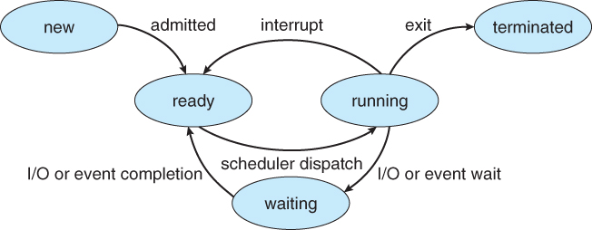

<h1>Linux System Programming</h1>

1. Linux how to use
2. porting linux on board(porting)
3. device driver programming
4. application progrmming

임베디드에서의 System == System call

1. sudo -s : root(막강한 권한)계정으로 switching account
2. pw : mdsmds로 설정됨
3. ip가 안잡혀있는 eth8번 설정
4. ifconfig eth8 182.168.0.2
5. sudo chwon -R mds:adm exercise_lsp

>네트워크 구성도


>파일 컴파일,링커 개요


### BSS를 DATA와 분리시키고 0으로 초기화하는 과정이 .o파일 이후에 되는 이유

- int git[100];같은 전역변수가 생상됐을 때
  data영역에 생성되면 0이 100개가 생성되기 때문에 .o파일의 용량이 커지게 된다. 그래서 ram으로 복사할 때 0으로 초기화됨

리눅스 구성 3요소
- rootfs(root file system)
- boot loader
- zImage(kernel)

### POSIX
- 애플리케이션 인터페이스 규격
- 함수 이름을 통일한 것

### 라이브러리
- 정적 라이브러리
- 동적 라이브러리
- 공유 라이브러리

### 공유 라이브러리
- 공유 라이브러리의 여러 명칭 : shared libraries, shared objects, dynamic shared objects (DSOs), dynamically linked libraries (DLLs - if you're coming from a Windows background)
- LD_LIBRARY_PATH를 사용해 공유 라이브러리 경로 지정
  - export LD_LIBRARY_PATH=$LD_LIBRARY_PATH:/usr/local/lib
- /etc/ld.so.conf 를 사용해 공유 라이브러리 경로 지정
>경로 지정을 하지 않을 경우  
$ gcc -o main main.c -L/usr/local/lib -lmylib  
$ ./main  
$ ./main: error while loading shared libraries: libmylib.so: cannot open shared object file: No such file or directory
```
$ gcc -fPIC -c mylib.c
$ gcc -shared -WL,-soname,libmylib.so.1 -o libmylib.so.1.0.1 mylib.o
$ cp libmylib.so.1.0.1 /usr/local/lib
$ ln -s /usr/local/lib/libmylib.so.1.0.1 /usr/local/lib/libmylib.so
```

공유폴더 만드는 방법
```
[root@localhost ~]$ gcc -fPIC -c *.c
[root@localhost ~]$ gcc --shared -Wl,-soname,libfoo.so -o libfoo.so func1.o func2.o
[root@localhost ~]$ nm -D libfoo.so
[root@localhost ~]$ sudo ldconfig -n .
[root@localhost ~]$ gcc -o program program.o -L. -lfoo
[root@localhost ~]$ ldd program
```
```
[root@localhost ~]$ gcc -fPIC -c *.c
[root@localhost ~]$ gcc -shared -Wl,-soname,libfoo.so.1 -o libfoo.so.1.0 *.o
[root@localhost ~]$ ln -s libfoo.so.1.0 libfoo.so.1
[root@localhost ~]$ ln -s libfoo.so.1 libfoo.so
[root@localhost ~]$ LD_LIBRARY_PATH=`pwd`:$LD_LIBRARY_PATH ; export LD_LIBRARY_PATH
[root@localhost ~]$ su
[root@localhost ~]# cp libfoo.so.1.0 /usr/local/lib
[root@localhost ~]# /sbin/ldconfig
[root@localhost ~]# ( cd /usr/local/lib ; ln -s libfoo.so.1 libfoo.so )
```
- fPIC 옵션은 프로세스의 가상 주소 공간 안의 다른 지역에 로드될 수 있도록 코드를 컴파일 한다. 실행 될 때 그 위치가 정해지기 때문에 가상 공간 안에 고정된 위치를 가지면 안 된다.
- shared 옵션은 공유 라이브러리를 만든다는 옵션이다.
- Wl 옵션은 gcc에게 콤마로 부분된 다음 옵션을 링커에게 알려주기 위한 것이다.
- soname,libfoo.so.1 라이브러리에 대한 soname을 고정시키는 부분이다.
```
LD_LIBRARY_PATH=`pwd`:$LD_LIBRARY_PATH ; export
```
- LD_LIBRARY_PATH: 현재 폴더를 공유 라이브러리 탐색 경로에 넣어준다.
- ldconfig은 /etc/ld.so.conf에 지정된 디렉토리를 찾아다니면서 발견된 각각의 동적 라이브러리들에 대해서 그 라이브러리의 soname에 의해서 불리어지는 심볼릭 링크들을 만들어낸다. 위에 soname에 주어진 이름으로 새로운 심볼릭 링크를 만든다.공유 라이브러리를 이용해서 컴파일을 할 경우 .so를 먼저 경로에서 찾고 없으면 .a를 찾아 주소값을 결정한다.


### 하드링크 심볼릭 링크
- 하드링크 
    $ ln [원본 파일명] [대상 파일명]
  - 하나의 파일에 여러 개의 이름을 부여함,
  - 파일을 없애려면 링크로 생성된 링크 파일을 모두 지워야 함
- 심볼릭 링크
    >$ ln -s [원본 파일명] [대상 파일명]
  - 포인터와 같은 개념(윈도우 바로가기 아이콘)
  - 링크로 생성된 파일에 내용이 존재하지 않고 각각의 i-node를 가진 또 다른 파일이 어디를 가리키고 있는지 알려주는 역할
  - 원본파일명이 바뀌면 사용하지 못함


 


## System Call

1. system call
2. call <i>library</i> function
3. 함수의 인자값 처리 및 EAX 레지스터에 시스템 콜 등록
4. 0x80(intel) or SWI(arm)
5. Processor가 커널 모드(arm에서는 SVC모드)로 전환
6. 커널이 Interrupt에 대한 system call 루틴을 호출
7. 현재 레지스터 값들을 스택에 저장
8. 넘겨받은 인자값들 확인
9. system call 루틴 실행
10. 스택에 저장된 레지스터값들 복구
11. Processor가 사용자 모드(이전 모드)로 전환
12. system call 함수로부터 return

- Systemcall은 User Level이 아니어도 부를 수 있다. Supervisor모드에서도 호출 가능
- SWI(software interrupt) : User Level에서 Kernel Level로 이동하게(switching mode) 하는 instruction

>리눅스 파일 권한


-rwx-|-xr-|-x-  
--|---|---
User|Group|Other

- r: read
- w: write
- x: execute

### File open
```c
#include <sys/types.h>
#include <sys/stat.h>
#include <fcnt1.h>
/*open fopen 차이*/
int fd = open(const char *pathname, int flags); // low Level F/O function, type1
int fd = open((const char *pathname, int flags, mode_t mode);// low Level F/O function, type2
FILE *pf = fopen(const char *pathname, int flags, mode_t mode);// high Level F/O function
//flag : O_RDONLY, O_WORLD, O_RDWD, O_CREAT, O_EXCL...
```

### Data & Meta Data
- Data: 파일의 내용
- Meta Data: 파일의 정보

## Process
>Process : 프로그램이 실행되어 돌아가고 있는 상태

>Process State  


<b>프로세스 관련 쉘 명령</b>  
- top : 프로세스 증 제일 cpu가 많이 쓰이는 프로세스
- ps -(e,f,l,L) : 현재 프로세스를 보여줌
- pstree : 프로세스를 트리 형태로 보여줌
- fg/bg: fore ground/ back ground

- execl : 현재 실행되고 있는 프로세스를 덮어 씌워서 실행하는 함수

### fork()  
- 부모와 같은 자식을 낳는 프로세스 
- fork() process는 부모와 자식이 같은 file table, text를 공유해서 사용한다.
- 오직 자식의 pid만 0, 부모는 0>pid

## Scheduler
- CFS(Completely Fairness Scheduler)
- RT(Real Time)
- Deadline
  
>우선순위  

CFS에서는 NI값을 이용해 우선순위를 동적으로 바꿀 수 있다.  
- 숫자가 낮을수록 우선순위가 높다.
- realtime priority에서는 숫자가 높을수록 우선순위가 높다.
- -40의 priority는 RT schedule을 따름
- ps -l : PRI(-40~99)는 cfs를 따름
- top : PR(-20~30)는 cfs를 따름
- ps -l의 80 == top의 20

### Realtime에서 우선순위가 같을 때 우선순위 결정 방법
- SCHED_FIFO: 먼저 온 프로세스가 무조건 우선
- SCHED_RR: 적당하게 번갈아가며 우선순위 책정  
  
## Thread
>리눅스의 쓰레드는 `가벼운 프로세스(Light Weight Process) `이다.

- 쓰레드간에는 프로세스끼리와는 달리 Cache의 내용을 공유할 수 있다.

[Thread 참고자료](https://reakwon.tistory.com/56)

## Difference Process & Thread
>Process
  
각 프로세스간 독립적으로 작동한다.

>Thread

Code, Data, Heap을 공유하기 때문에 서로 의존적이다.

### 쓰레드의 생성
```c
int pthread_create(pthread_t *thread, const pthread_attr_t *attr, void*(*start_routine)(void*), void *arg);
/*
- *thread : id of thread
- attr : attribute thread, NULL if default
- start_routine : 쓰레스 수행을 시작할 위치, 쓰레드 함수 이름
- arg: 생성될 스레드에 전달될 인자들(없으면 NULL)
*/
```
- 쓰레드의 Schedule은 부모의 Schedule policy를 그대로 따른다.  

### pthread_join()   
```c
int pthread_join (pthread_t thread, void *value_ptr);
```
- 지정된 id의 스레드가 종료할 때까지 이 함수를 호출한 스레드를 정지(suspend)시킨다.
- `여러개의 스레드가 한 스레드를 종료시킬 수는 없다.`
- pthread_exit() 으로 종료되면 리턴값을 인자로 받아 리턴한다.

