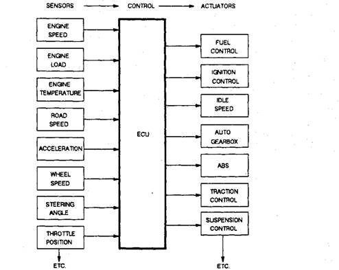
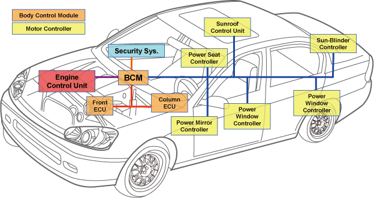
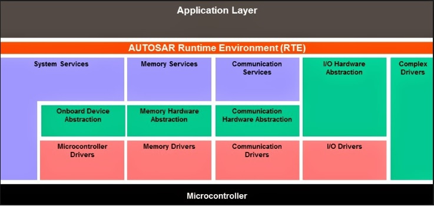
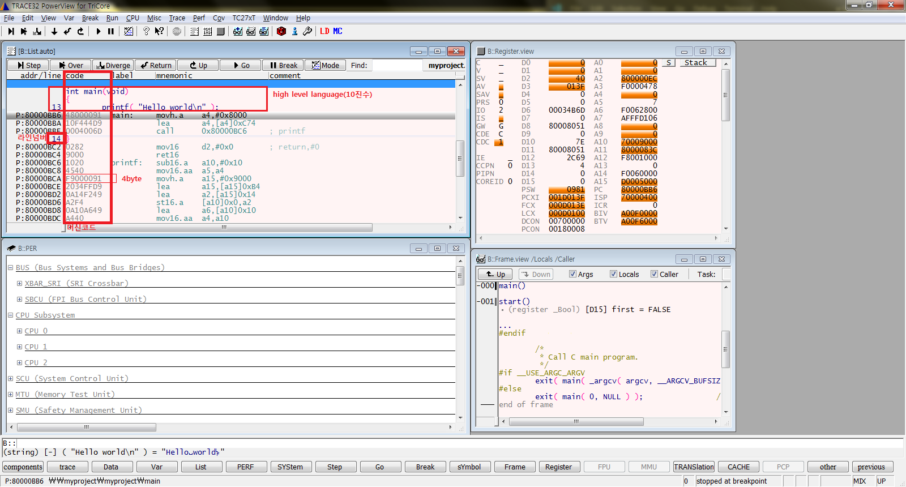
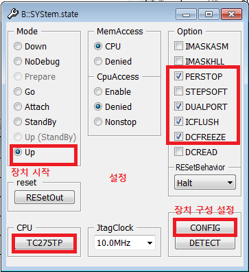
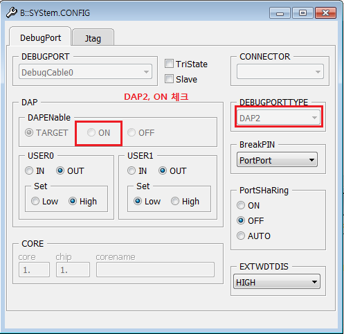
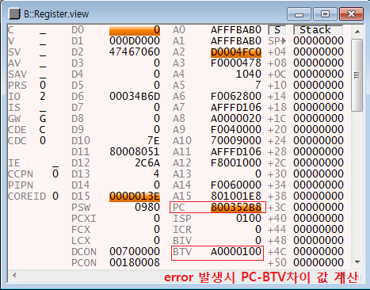
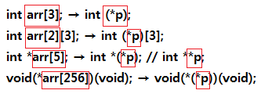

# 차량용 SW개발


MISRA-C 룰

## Control System

## Automotive Control System


- System
- Powertrain
- Chassis
- Body
- Infotainment
- Carburetor
- ECU(Engine Control Unit)
- ECU(Electronic Control Unit)
- ABS Controller

### Software engineering model
- CMMI(Capability Maturity Model Intergration)
- Waterfall model
- V model
- V model(toll-base developement process)


### MDB(Model Based Design)
- 모델 복잡도를 낮추고 생산성을 높이는 모델
- Auto Code Generator 제공
- V Cycle
  - MIL, SIL, PIL, HIL
- 자동차 SW에서의 최소unit : 함수


## AUTOSAR
- `AUT`omataion `O`pen `S`ystem `AR`chitecture
- Software, configuration tool, Auto code generation
### AUTOSAR ECU Software Architexture
- divided in three parts
- AUTOSAR Application Software
- AUTOSAR Basic Sofrware(BSW)
- AUTOSAR Runtime Environment(RTE)

>AUTOSAR Architecture


>AUTOSAR Architecture Detail


### ISO26262
- HARA(Hazard Analysis and Risk Assessment)

### SAE J3061
- TARA(Threat Assessment and Remediation Analysis)
- SHE -> EVITA
  

### MCU Manual - AURIX
- Process
  - Core
  - MPU
  - FPU
- Peripheral Controller
  - I/O
  - ADC
  - Timer
  - Interrupt
  - CAN

### 컴파일 및 실행 과정
1. Proprocess : hello.h + hello.c->hello.i
2. Compile : hello.i -> hello.s
3. Assemble : hello.s -> hello.o
4. Link : hello.o + hello_sub.o -> a.out(a.elf, a)


# 최적화 방법
- performance Optimization
  - 메모리 접근을 최소화 한다.(메모리 접근 비례 속도 저하)

- Memory Optimization
  - #Pragma를 잘 써야함


### Trace32 설정
- CPU TC275TP
- DUALPORT 체크
- DAPEnable ON
- DEBUGPORTTYPE DAP2

>LD 화면 기능 설명


>System setting법  


>Config setting



- 슈퍼 스칼라 ISe조합이 있다.


- 디버거 리셋 방법 : B::sys.up
- aurix는 double과 float를 4바이트로 인식함: 실행 속도를 높히기위해
- 만약 double을 8바이트로 설정하면 연산 클럭이 70사이클 정도 소모되나 4바이트로 하면 3사이클 정도로 낮아짐

- pc값을 바꾸는 명령어 : call, ret
- psw : arm에서의 cpsr, spsr 같은 명령어
- PCXI : 이전 context information
- FCX : Linked List node 의 Head pointer
- LCS : Linked List node 의 Tail pointer
- CSFRs(Core Special Function Registers): Supervisor 모드로의 접근 하기위한 방법, High Level에서는 접근 불가. Low Level에서만 접근 가능함(특별한 방법으로)
- MTCR, MFCR
- A15, D15 : Implicit Data
- Implicit data is information that is not provided intentionally(의도적으로) but gathered from available data streams, either directly or through analysis of explicit data.
- Explicit data is information that is provided intentionally, for example through surveys and membership registration forms.

### Upper Context
The upper context is automatically saved on `call, interrupt or trap.`

### Lower Context
The lower context has to be saved explicitly with an instruction.

- CSA(Context Save Area) : Context를 저장하는 별도의 공간.
- 명령어가 실제로는 0-7번 메모리를 접근하지만 C, D에 접근하는 것처럼 보이게 해서 코어간에 간섭이 없게 한다.

- MPP(Memory Protection Peripheral Access) : (TIN 5)
A program executing in User-0 mode attempted a load or store access to a segment is
configured to be a peripheral segment.

- PRIV(Privilege Violation) : A program executing in one of the User modes (User-0 or User-1 mode) attempted to
execute an instruction not allowed by that mode.
A table of instructions which are restricted to Supervisor mode or User-1 mode, is
supplied in the Instruction Set chapter of Volume 2 of this manual.

### Peripheral Space
- Only `Supervisor` and `User-1` mode data accesses are permitted.
- User-0 mode data accesses are not permitted and result in an MPP trap.
- Code accesses are not permitted and will result in a PSE trap
- All CPU accesses to the memory segment are non-cached.
- All CPU accesses to the memory segment are non-speculative.
- Context operations and accesses using circular addressing are not permitted.


>floating point는 동등 비교 연산을 하면 안된다.
ex) if(float==6.625)  금지

다른 자료형은 signed가 default값이지만 char는 옵션을 따라서 unsigned와 signed가 정해진다.

### BTV
The BTV register specifies the Base address of the Trap Vector table.  
BTV는 Trap register Table의 시작 주소



error값 찾는 법
1. PC의 위치가 어디인지 찾는다.
2. PC의 위치가 Trap Table의 어느 위치에 있는지 찾기 위해 PC의 주소와 BTV의 주소값의 차이를 구한다.
3. 차이만큼의 위치가 Error class의 위치이다.


```c
char *( *(*var)() )[10];
 ^   ^  ^ ^ ^   ^    ^
 7   6  4 2 1   3    5
```
1. The identifier var is declared as
2. a pointer to
3. a function returning
4. a pointer to
5. an array of 10 elements, which are
6. pointers to
7. char values.


### integral promotion  
char + int => int + int  
char + short => **`int`** + **`int`**  
int + float => double + double(컴파일러마다 상이)  
float + double => double + double  




```asm
mov16.a a0, #0xFF
  ^      ^    ^
operator operand
```

BASEOF1.OP2  
ex)ADDS.B

```
D : destination
S1 : source1
S2 : source2

ADD D0, D1, D2
     ^  ^   ^
     D  S1  S2


ADD D0, D1
    ^   ^
  D/S1  S2

MOV D0, D1
    ^   ^
    D   S
```

### I/O 제어 방법
- int *p = 0xFF1111111;과 같은 변수로 접근하지 않는 이유:
  pointer메모리를 추가로 더 할당해야 하기때문에 비효율적임
- 그래서 상수->변수로 케스팅 하여 사용함(`*변수 사용`)

```c
*(volatile unsigned int*)0xF0000000 = 10;
*(volatile struct ID*)0xF0000000 = 10;

typedef volatile struct _IFx_P
{
  ...
}Ifx_P;

#define MODULE_P00 /*lint --e(923)*/ (*(Ifx_P*)0xF003A000u)

```

Data Type Modifier|Name|Description|Example
---|---|---|---
D|Data|32-bit data |MOV.D
D|Double-word|64-bit data/address |LD.D
W|Word|32-bit (word) data |EQ.W
A|Address|32-bit address |ADD.A
Q|Q Format|16-bit signed fraction (Q format) |MADD.Q
H|Half-word|16-bit data or two packed half-words |ADD.H
B|Byte|8-bit data or four packed bytes |ADD.B
T|Bit|1-bit data |AND.T
U|Unsigned|Unsigned data type|ADDS.U