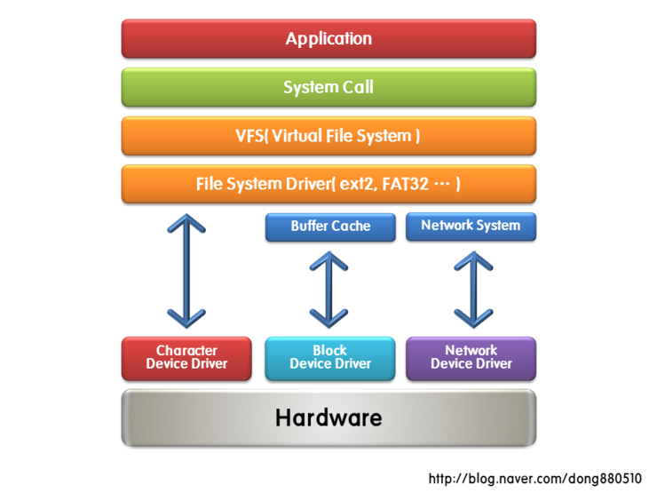

# 차량용 OS 디바이스 프로그래밍

## 커널(Kernel)
>커널은 OS이다

### OS
- 선점 OS: 특정 프로세스가 CPU 를 독점하는것이 불가능(운영체제가 강제로 프로세스의 CPU 점유를 제어)하면 선점형

- 비선점 OS: 특정 프로세스가 CPU 를 독점하는것이 가능 (프로세스가 스스로 CPU 점유를 포기해야만 다른 프로세스가 실행)하면 비선점형


#### 디바이스 드라이버에서는 특정주소를 바로 접근하면 안된다.
- 디바이스 드라이버도 커널 영역에 속해있다.

>유닉스는 파일 시스템 구조에 크게 의존한다.
- Open, Read, Write, Close


make menuconfig




### 리눅스 컴파일 순서
1. make mds2450_deconfig
2. make zImage(linux kernel 실행파일)
3. rfs(root flie system)

nfs(network file system)를 사용하면 보드에 file system 이 있는 것처럼 사용 가능
리눅스 부팅 시 중요한 사항
- bootargs
- bootcmd

teraterm setting
```
bootdelay=3
baudrate=115200
ethaddr=00:40:5c:26:0a:5b
gatewayip=192.168.20.1
netmask=255.255.255.0
boot=test
serverip=192.168.20.90
ipaddr=192.168.20.11
bootcmd=tftp 30008000 zImage;bootm 30008000
bootargs=root=/dev/nfs rw nfsroot=192.168.20.90:/work/rootfs ip=192.168.20.246:192.168.20.90:192.168.20.1:255.255.255.0::eth0:off console=ttySAC1,115200n81
stdin=serial
stdout=serial
stderr=serial
```

static 함수 사용 : 한 파일 내에서만 사용하기 위해